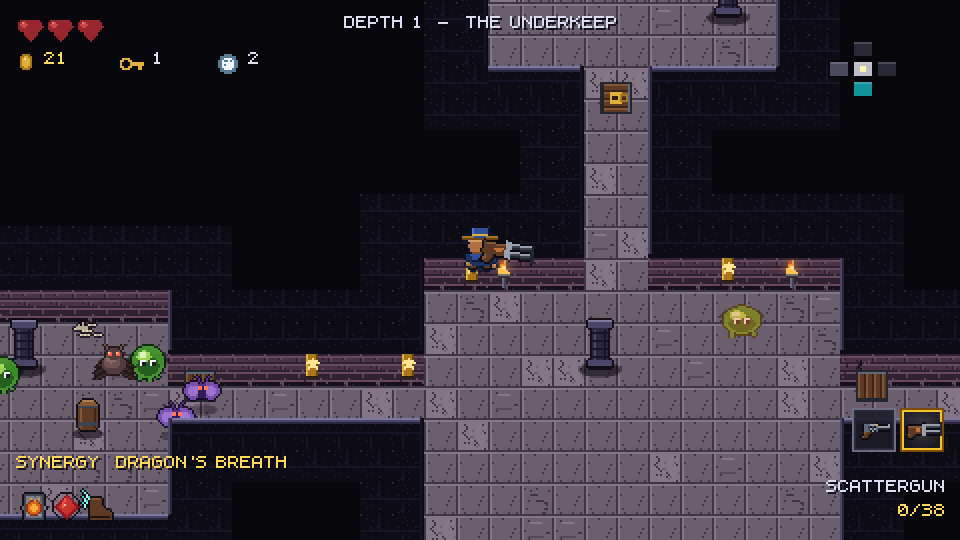
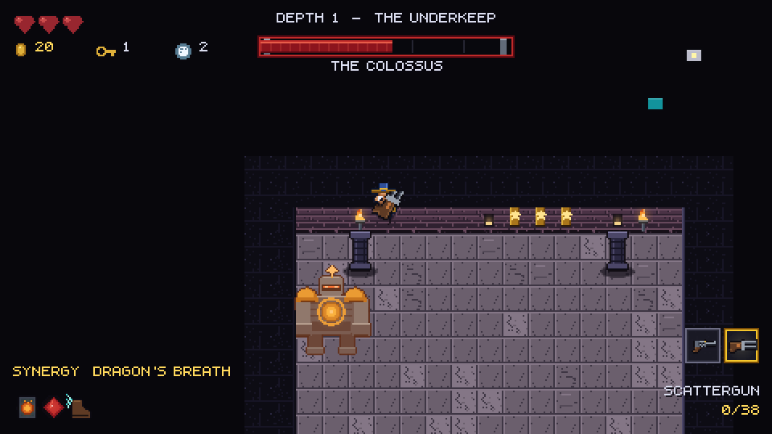
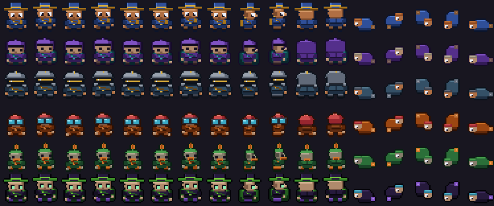
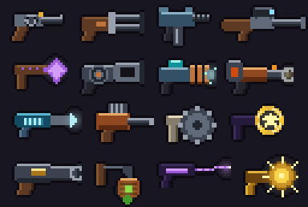
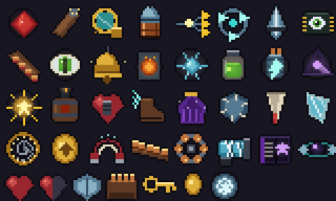

# Pixel Rogue

A top-down pixel-art roguelike shooter in Swift, in the vein of *Enter the
Gungeon*, *The Binding of Isaac* and *Blazing Beaks*: four floors of
procedurally generated rooms, sixteen guns, thirty-two passives, bullet-hell
bosses, and named synergies that rewrite how your build plays.

Every sprite, every animation frame, the font and every sound effect in the
game is **generated from code**. There is not a single hand-drawn asset in the
repository — `Tools/pixelforge` draws all of it.



---

## Running it

**On iPad (Swift Playgrounds):** download the repository, unzip it in the
Files app and tap `PixelRogue.swiftpm`. Full instructions and the touch
controls are in **[docs/IPAD.md](docs/IPAD.md)**.

**On macOS:**

```bash
# 1. generate the art and audio (any platform, needs Pillow)
pip install pillow
python3 Tools/pixelforge/build_assets.py --out Assets/generated
python3 Tools/pixelforge/soundforge.py   --out Assets/generated/sfx

# 2. play it (macOS 13+)
swift run PixelRogue
```

The generated assets are committed, so step 1 is only needed after changing a
generator.

| | |
|---|---|
| Move | `WASD` / arrows / left stick |
| Aim | mouse / right stick |
| Fire | left click / right trigger |
| Dodge roll | `Space` — brief invulnerability, no steering once committed |
| Reload | `R` |
| Blank | `Q` / right click — clears every enemy bullet and shoves them off you |
| Take | `E` — guns and passives need a confirm, consumables auto-collect |
| Swap weapon | `Tab`, scroll, or `1`–`4` |
| Pause | `Esc` — also where you read your build |

## Looking at it without a Mac

The renderer needs SpriteKit, but the *decision* of what to draw where lives in
the platform-independent core, so a frame can be produced anywhere:

```bash
swift run PixelRogueSnapshot --scenario boss --seed GUNGEON --out scene.json
python3 Tools/pixelforge/render_scene.py scene.json --out frame.png
```

`PixelRogueSnapshot` runs the real simulation with a scripted bot and dumps the
draw commands; `render_scene.py` composites them against the real atlas. Same
sprite names, same anchors, same depth order as the macOS build.



---

## How it looks the way it does

The "2D sprites standing on a 3D-looking map" effect is not a 3D camera. It is
three rules:

1. **A wall is two tiles.** A *cap* seen from straight down, and a *face* seen
   from the front, drawn one tile lower. `Tools/pixelforge/pixelforge/tiles.py`
2. **Everything except the floor sorts by world Y**, and a wall block sorts by
   its *bottom* edge. So an actor standing south of a wall draws in front of
   it, and an actor in the room beyond draws behind it — from one comparison.
   `Sources/PixelRogueCore/View/SceneSnapshot.swift`
3. **Characters are anchored at a ground row**, not at their centre, so a tall
   hat never lifts anyone off the floor. `pixelforge/chars.py`

The rest is value control: the floor is the brightest large surface, the wall
mass behind it is nearly black, and only the exposed edge of a wall block
catches light. That contrast is what makes a room read as a lit space rather
than as a texture.

## The art pipeline

`Tools/pixelforge` is a small pixel-art library plus a set of generators.

| Module | What it draws |
|---|---|
| `palette.py` | Every material as a 5-step ramp. No generator ever picks a raw colour. |
| `canvas.py` | An RGBA raster with pixel-art primitives — lines, ellipses, outlines, dithers, ramp-aware shading. |
| `shapes.py` | Composites shared by everything: rounded rects, domes, rings, glows, contact shadows. |
| `chars.py` | One parametric 3/4-view rig producing all six players *and* every humanoid enemy: idle, walk, roll, hurt and death, in three facings. |
| `enemies.py` | Blobs, floaters, crawlers, bombers, turrets, drones, and four multi-phase bosses. |
| `tiles.py` | Four biomes of floors, autotiled wall caps, wall faces, doors and props. |
| `weapons.py` | Sixteen guns, each shipping a grip pivot and a muzzle point. |
| `items.py` | Thirty-two passives, each with a distinct silhouette so it reads in a 16px slot. |
| `fx.py` | Projectiles and effects — explosions, sparks, portals, poison clouds, chain lightning. |
| `font.py` | A 5x8 bitmap font. System fonts anti-alias, which looks like a bug next to hard-edged art. |
| `atlas.py` | Shelf packer and the JSON manifest the Swift side loads. |

One 2048x512 page holds 1063 sprites and 164 animations.





`soundforge.py` does the same for audio: 33 cues built from oscillators and
envelopes, no samples.

## Architecture

```
Sources/
  PixelRogueCore/     simulation — no Apple frameworks, runs and tests on Linux
    Math/             vectors, deterministic RNG, collision, easing
    World/            tile map, grid-of-rooms generation
    Sim/              actors, projectiles, the step loop, events
    Combat/           weapons, stats, status effects, bullet-hell patterns
    Content/          weapon / item / synergy / enemy / boss catalogues
    Run/              run state, characters, loadout derivation
    View/             SceneSnapshot — what to draw, and where
  PixelRogueApp/      SpriteKit renderer, HUD, input, audio, macOS shell
  PixelRogueSnapshot/ headless frame dumper
PixelRogue.swiftpm/   the iPad build, assembled from the above by
                      Tools/make_swiftpm.py — one flat module, SwiftUI shell,
                      touch controls
```

The simulation never touches SpriteKit, never plays a sound and never moves a
camera. It appends to an event queue and the presentation layer drains it.
That boundary is what lets the entire ruleset run headless in tests.

### Synergies

The item pool is interesting because of what items do *together*. A synergy
names specific things you are carrying and rewrites the weapon definitions
they apply to:

```
Ember Core     + Scattergun  →  Dragon's Breath   every pellet ignites, +3 pellets
Gunpowder Keg  + Nail Driver →  Nail Bomb         nails detonate where they land
Heavy Slug     + Longarm     →  Hollow Point      punches through the whole line
Clock Spring   + Phase Cloak →  Bullet Time       dodging slows the world
two cold items               →  Ice Nine          chilled enemies freeze outright
```

Twenty-five of them, in `Content/Synergy.swift`. `Loadout.recompute()` rebuilds
stats and weapon definitions from scratch on every inventory change rather than
patching incrementally, so a synergy correctly *stops* applying when you swap
its weapon away — the case incremental updates always get wrong.

## Tests

```bash
swift test        # 56 tests
```

They cover the parts worth covering:

- **Determinism** — one seed, one floor, forever.
- **Connectivity** — every room on every generated floor is reachable, checked
  across 25 seeds. Every floor has exactly one start and at least one boss.
- **Collision** — 600 frames of walking into a wall leaves you outside it.
- **Combat** — fire rate is respected, ammo depletes, i-frames stop a volley
  landing six times, armour absorbs before health.
- **Synergies** — they activate, they modify the weapon they name, they
  deactivate when it is dropped, and they never compound onto their own output.
- **Depth order** — bullets always sort above bodies; an actor south of a wall
  sorts in front of it.
- **Cross-language contract** — every sprite name referenced from Swift exists
  in the manifest the Python pipeline emits, and the font can render every
  string the game prints. This is the test that catches a rename in a
  generator before it becomes an invisible missing sprite at runtime.
- **Soak** — two simulated minutes of random input with no NaN, no escaping
  the map, no unbounded projectile growth.

## Adding content

- **A weapon**: draw it in `weapons.py` (return a `WeaponArt` with a grip
  pivot and a muzzle point), then add a `WeaponDef` in `WeaponCatalog`. The
  contract test will tell you if the names disagree.
- **An enemy**: a humanoid is a `CharSpec` in `enemies.py` plus an `EnemyDef`;
  a creature needs its own frame generator.
- **A synergy**: one entry in `SynergyCatalog`. Requirements can be specific
  items, specific weapons, or a count of items carrying a tag.
- **A biome**: one `Theme` in `tiles.py` — it parameterises every tile.

Rebuild the atlas and run the tests after any of these.

## Known limitations

- **The renderer needs an Apple platform.** SpriteKit is an Apple framework;
  the game logic is portable but the presentation layer is not. Because that
  layer cannot be compiled anywhere but on macOS or iPadOS, it is the
  least-verified code in the repository — the snapshot tool exists
  specifically to cover for that, but it exercises `SceneSnapshot`, not
  SpriteKit itself.
- **No music**, only sound effects.
- **No save or meta-progression.** A run is a run.
- **Secret rooms are generated but have no reveal mechanic** — they are
  reachable through an ordinary door for now.
